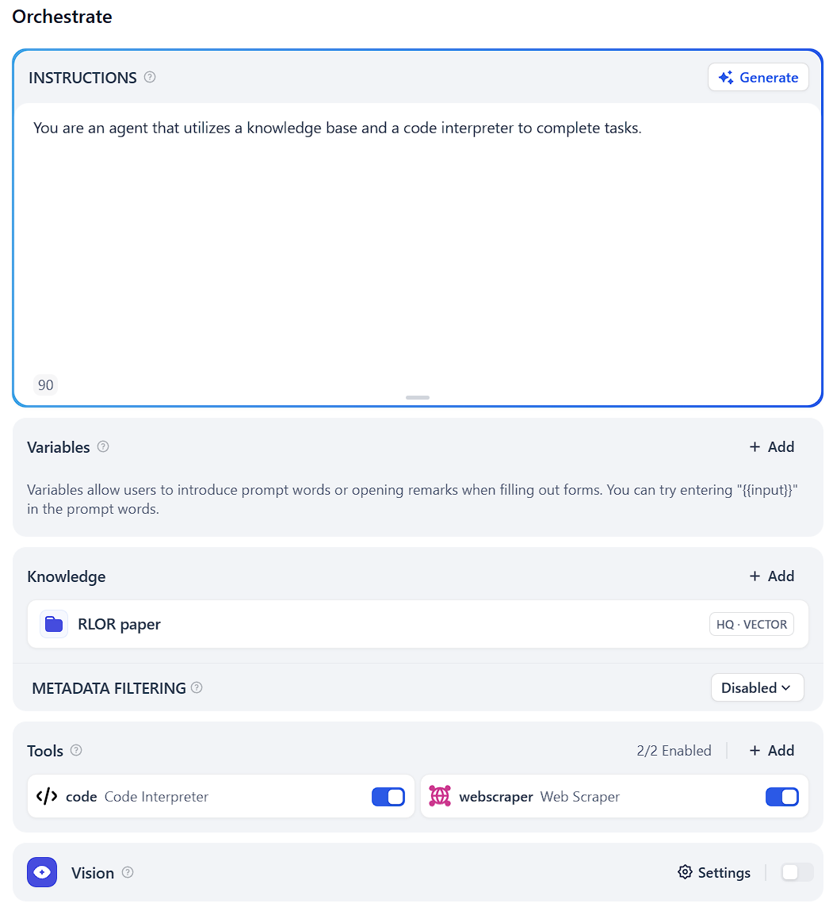
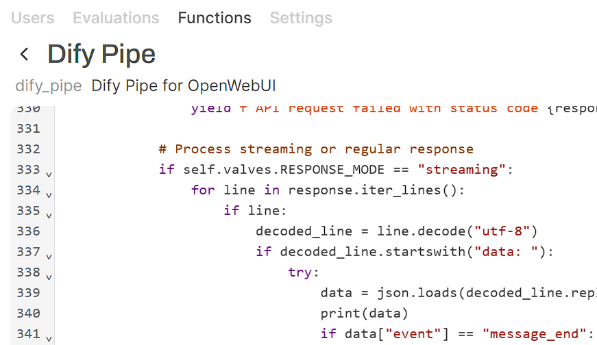
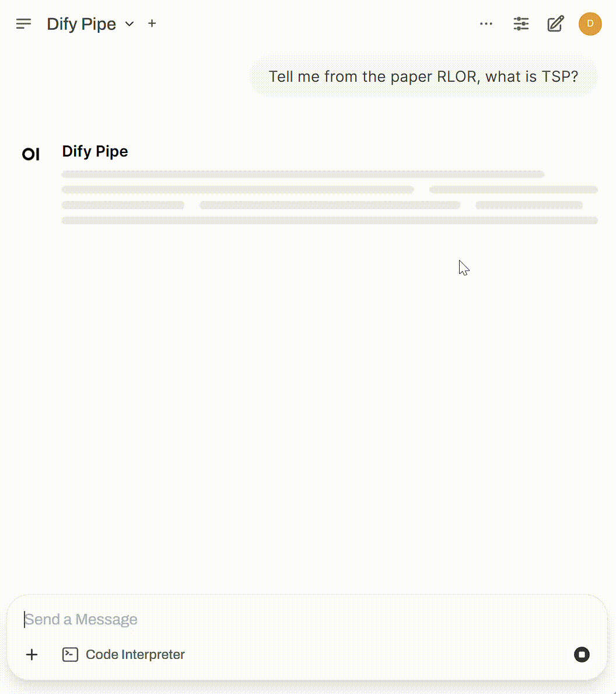

# OWUI_PIPE

> Based on https://openwebui.com/f/teddylee777/dify_pipe

This repo contains pipe for OpenWebUI integration.

## Dify Agent

### Setups
1. Set up the appropriate agent in Dify.

    

2. For the knowledge base, add the metadata field `url` and set it accordingly.

    

3. Import the function [`code`](dify_pipe.py) into OpenWebUI.

    

4. Test it out.

    