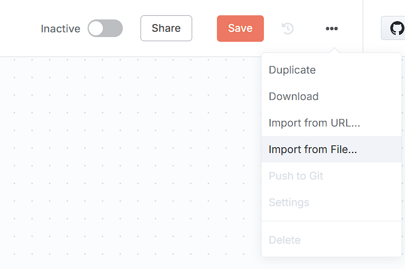
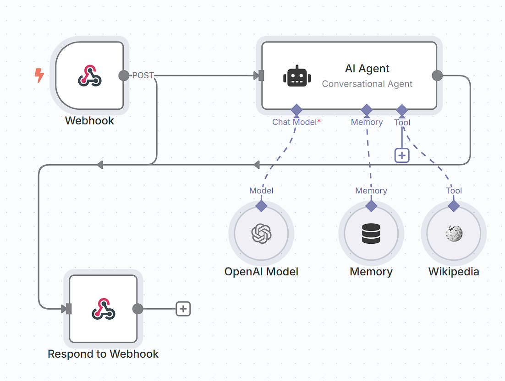
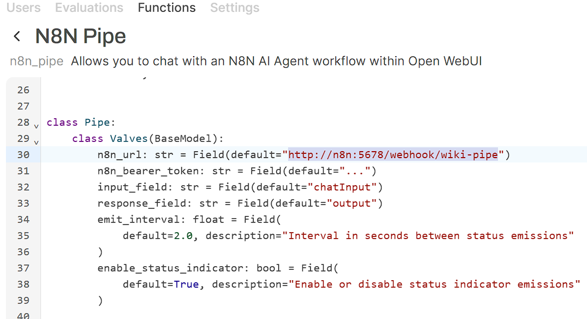
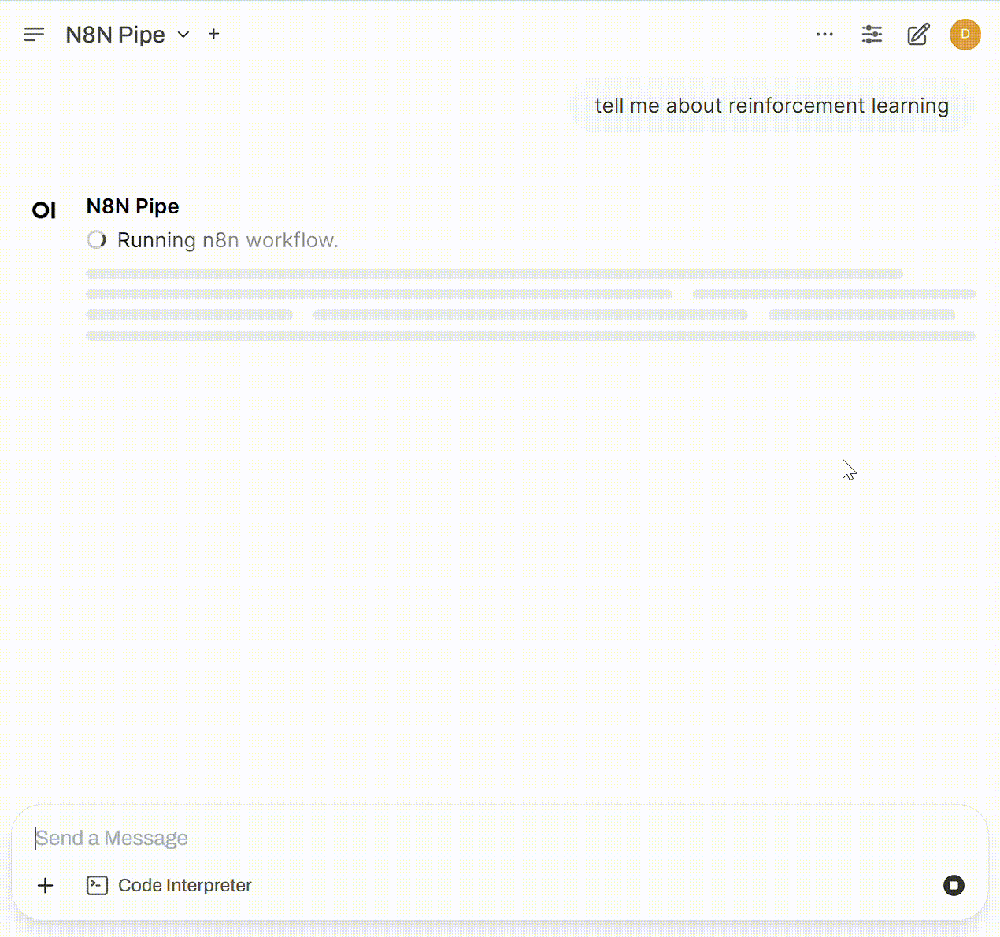

# OWUI_PIPE

> Based on https://openwebui.com/f/coleam/n8n_pipe

This repo contains pipe for OpenWebUI integration.

## n8n Agent

### Setups
1. Import from the example `n8n_agent_demo.json`

    

2. Check and fix the n8n nodes.

    

3. Save and activate the workflow.

    

4. Import the n8n_pipe.py to OWUI.

    

5. Expected Results.

      

### Limitation

- does not support returning intermidiate steps while they are executing.